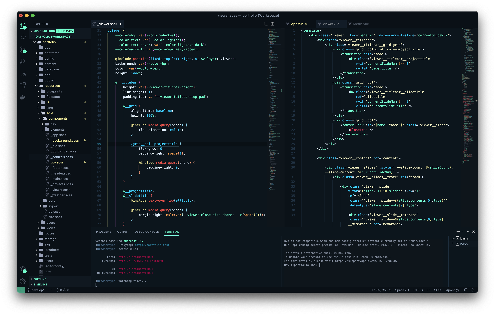

# Athabasca VS Code Theme
Athabasca comprises two dark, colorful themes inspired by the [Glacier Theme](https://github.com/shovelandsandbox/glacier-theme) for Sublime Text. 

## Bracket Pair Colorization
Includes thematic bracket pair colors when VS Code's native bracket pair colorization is enabled in `settings.json`:

```json
{
    "editor.guides.bracketPairs": true,
    "editor.bracketPairColorization.enabled": true
}
```

## Screenshot

